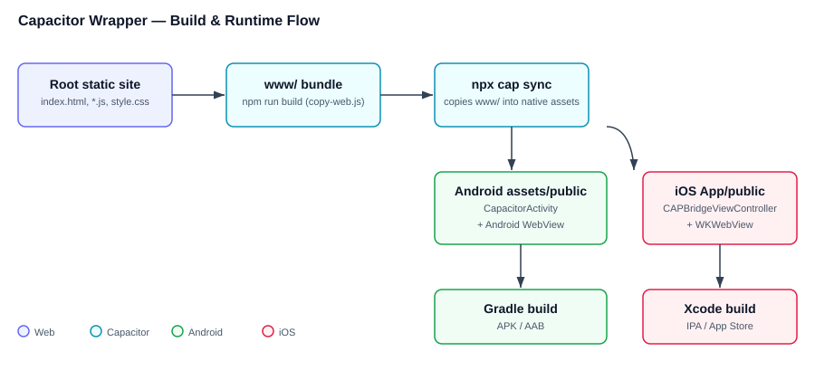

# Tech Stack & How the Capacitor Wrapper Is Built

This document describes the technology stack and, in detail, how the native
Android wrapper is produced from the static web project using Capacitor.

## 1. Overall tech stack

| Layer | Technology | Notes |
|-------|------------|-------|
| UI | Plain HTML + CSS (`style.css`) | No JS framework; multi-page site |
| Logic | Vanilla JavaScript (`common.js` + per-page `*.js`) | Shared helpers in `common.js`, page logic in `emi.js`, `ebbill.js`, `tax.js`, `sip.js`, `gst.js`, etc. |
| Pages | `index.html`, `emi.html`, `ebbill.html`, `tax.html`, `sip.html`, `gst.html`, `payslip.html`, `bmi.html`, `offer.html`, `privacy.html`, `irpart.html`, `weightloss.html` | Each page links `style.css`, `common.js`, and its own script |
| PWA | `manifest.webmanifest` + `sw.js` (service worker) | Installable in browsers; offline cache |
| Tooling | Node.js + npm | Runs the Capacitor CLI and build scripts |
| Wrapper | Capacitor 6 (`@capacitor/core`, `@capacitor/android`, `@capacitor/cli`) | Wraps the web build into a native Android app |
| Native shell | Android (Java) WebView via Capacitor `MainActivity` | Built/deployed with Android Studio / Gradle |
| Icons | `android/app/src/main/res/mipmap-*` + `favicon.png` | Adaptive icon for Android 8+, legacy PNGs for older |

The site is **static** — there is no backend or build-time bundler. All pages
are authored directly in the project root and served as files.

## 2. How the wrapper is built (Capacitor flow)

Capacitor does not rewrite the web code. It takes a folder of static files and
copies them into a native Android project, which then displays them inside a
`WebView`. The flow has three stages: **author → bundle → sync → build**.

### Stage A — Author (project root)

The live site files live in the repository root:

```
index.html, emi.html, tax.html, ebbill.html, sip.html, ...
common.js, emi.js, style.css, favicon.png, manifest.webmanifest, sw.js
```

These are the same files used by the web/PWA path.

### Stage B — Bundle into `www/`

Capacitor requires a dedicated subfolder for its `webDir` (it rejects `.`), so a
small build script copies the site into `www/`:

```bash
npm run build        # runs: node scripts/copy-web.js
```

`scripts/copy-web.js` copies the static site into `www/` (gitignored) while
keeping `node_modules`, `android/`, and `docs/` out of the bundled app. The
target folder is declared in `capacitor.config.json`:

```json
{
  "appId": "in.simplecalculator.app",
  "appName": "Calculators",
  "webDir": "www"
}
```

### Stage C — Sync into the native project

```bash
npx cap sync android
```

This copies `www/` into the native asset folder:

```
android/app/src/main/assets/public/   <- exact copy of www/
```

and refreshes native config (`capacitor.config.json` values like `appId` /
`appName`) and any plugin native code. After editing any web file, re-run
`npm run build && npx cap sync` so the native app picks up the change.

### Stage D — Build & run the native app

```bash
npx cap open android     # opens Android Studio
# or from Android Studio / Gradle:
gradlew assembleDebug    # produces an APK
```

Android Studio builds a standard Android app whose `MainActivity` extends
Capacitor's `BridgeActivity` (a `WebView` host). On launch it loads the bundled
files from `assets/public/` (e.g. `capacitor://localhost/index.html`). Because
the assets are bundled locally, **no server or internet is required** — the app
is offline-capable by default.

## 3. Wrapper mental model



```
[ root static site ]
        │  npm run build (copy-web.js)
        ▼
     [ www/ ]  ── npx cap sync ──▶  [ android/app/src/main/assets/public/ ]
                                          │
                                          ▼
                                   [ Android WebView (CapacitorActivity) ]
                                          │
                                          ▼
                                  Native APK / AAB on device
```

The WebView simply renders the same HTML/CSS/JS that runs on the website. Web
JavaScript can call native features through Capacitor plugins (`@capacitor/app`,
etc.), though this project currently uses the wrapper mainly to host the UI.

## 4. Key files reference

| File | Role in the wrapper |
|------|---------------------|
| `capacitor.config.json` | App ID, name, `webDir` (`www`) |
| `package.json` | Capacitor deps + `build` / `rebuild` scripts |
| `scripts/copy-web.js` | Copies root site → `www/` |
| `www/` | Bundle consumed by Capacitor (gitignored) |
| `android/` | Generated native project (`cap add android`) |
| `android/app/src/main/assets/public/` | The web bundle inside the app |
| `android/app/src/main/res/mipmap-*` | App icons |
| `android/app/build.gradle` | `applicationId`, `versionCode`, `versionName`, SDK versions |

## 5. iOS target (optional)

The same web bundle can also become a native iOS app with the same Capacitor
flow — only the native platform differs.

### Prerequisites

- **macOS + Xcode** (iOS builds cannot be done on Windows/Linux).
- **Capacitor iOS platform** added to the project:

```bash
npm install @capacitor/ios
npx cap add ios
```

### Build flow (same as Android)

```bash
npm run build        # (re)create www/
npx cap sync ios     # copy www/ -> ios/App/App/public and refresh native config
npx cap open ios     # opens Xcode
```

In Xcode, set the **Bundle Identifier** to match `appId`
(`in.simplecalculator.app`), pick a signing team, then run on a simulator/device
or archive for TestFlight / App Store.

### How it differs from Android

| Aspect | Android | iOS |
|--------|---------|-----|
| Native shell | `CapacitorActivity` + Android `WebView` | `CAPBridgeViewController` + `WKWebView` |
| Bundle location | `android/app/src/main/assets/public/` | `ios/App/App/public/` |
| Build tool | Gradle / Android Studio | Xcode |
| Icons | `mipmap-*` adaptive + legacy PNGs | `Assets.xcassets/AppIcon.appiconset` |
| Offline | Bundled assets (no SW) | Bundled assets (no SW) |

The web code, `capacitor.config.json` (`webDir`, `appId`, `appName`), and the
`npm run build` step are identical; only the `sync`/`open` platform argument and
the native project differ.

## 6. Notes & gotchas

- **Service worker vs WebView**: `sw.js` powers offline/PWA in browsers, but the
  Android WebView does **not** run service workers. Offline support in the app
  comes from the locally bundled assets instead.
- **Relative paths**: keep asset references relative (`style.css?v=2`,
  `common.js?v=2`) so they resolve both on the web and inside the native shell.
- **Versioning**: after changing `style.css` / `common.js`, bump the `?v=` query
  and re-run `npx cap sync`.
- **Rebuild helpers**: `npm run rebuild` (Windows `scripts/rebuild.ps1`) and the
  bundled `android-rebuild` skill automate copy → sync → Gradle build.
